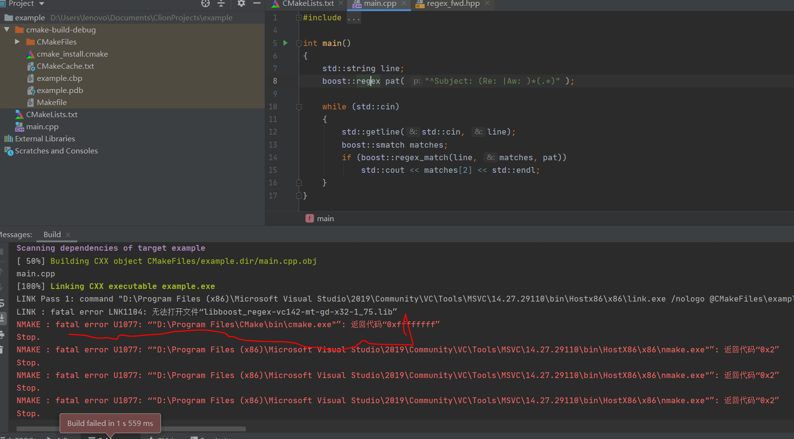
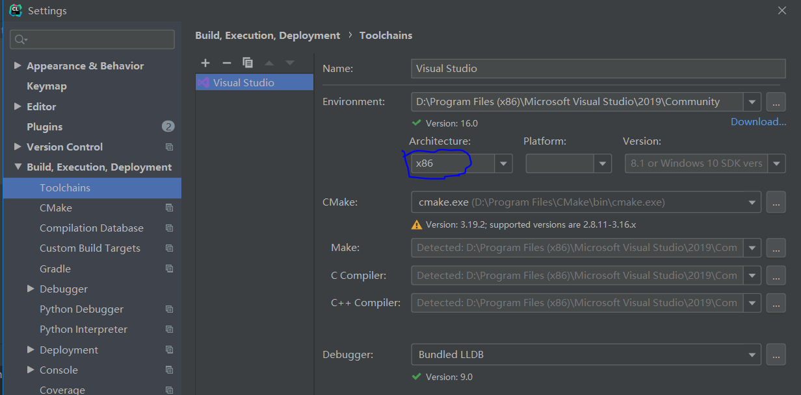
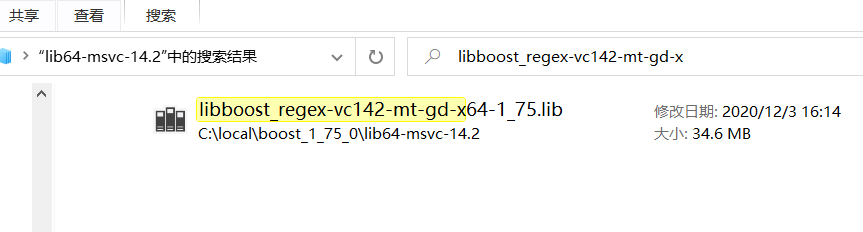
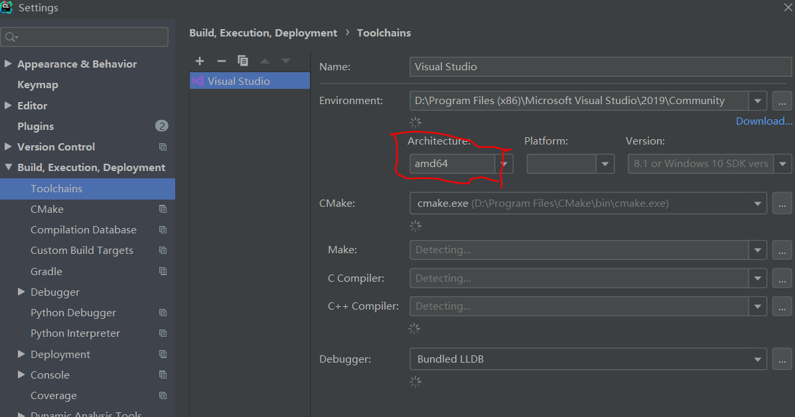

# LINK : fatal error LNK1104: can not open file "libboost_regex-vc142-mt-gd-x32-1_75.lib"

`LINK Pass 1: command "D:\Program Files (x86)\Microsoft Visual Studio\2019\Community\VC\Tools\MSVC\14.27.29110\bin\Hostx86\x86\link.exe /nologo @CMakeFiles\example.dir\objects1.rsp /out:example.exe /implib:example.lib /pdb:D:\Users\lenovo\Documents\ClionProjects\example\cmake-build-debug\example.pdb /version:0.0 /machine:X86 /debug /INCREMENTAL /subsystem:console -LIBPATH:C:\local\boost_1_75_0\lib64-msvc-14.2 kernel32.lib user32.lib gdi32.lib winspool.lib shell32.lib ole32.lib oleaut32.lib uuid.lib comdlg32.lib advapi32.lib /MANIFEST /MANIFESTFILE:CMakeFiles\example.dir/intermediate.manifest CMakeFiles\example.dir/manifest.res" failed (exit code 1104) with the following output:
LINK : fatal error LNK1104: 无法打开文件“libboost_regex-vc142-mt-gd-x32-1_75.lib”`


`NMAKE : fatal error U1077: “"D:\Program Files (x86)\Microsoft Visual Studio\2019\Community\VC\Tools\MSVC\14.27.29110\bin\HostX86\x86\nmake.exe"”: 返回代码“0x2”`

# Reason Analysis
## Current Toolchains config `Architecture` is `x86`.
Howerver ,there is no 32bit lib `libboost_regex-vc142-mt-gd-x32-1_75.lib` in dir `C:\local\boost_1_75_0\lib64-msvc-14.2`

## Attention: not found `libboost_regex-vc142-mt-gd-x32-1_75.lib` in the boost lib dir, but found `libboost_regex-vc142-mt-gd-x64-1_75.lib`.


# Solution
set Toolchain `Architecture` to `amd64`on CLion IDE.


# Appendix about CMakeList.txt
```Makefile
cmake_minimum_required(VERSION 3.19)
project(example)
set(BOOST_ROOT "C:/local/boost_1_75_0")
#set(BUILD_USE_64BITS on)
#set(CMAKE_CXX_LIBRARY_ARCHITECTURE x64)
find_package(Boost)
IF (Boost_FOUND)
    #link_directories(${Boost_LIBRARY_DIRS})
    link_directories(${BOOST_ROOT}/lib64-msvc-14.2/)
    include_directories(${Boost_INCLUDE_DIRS})
#    set(Boost_ARCHITECTURE "-x64")
#    set(Boost_USE_STATIC_LIBS OFF )
#    set(Boost_USE_MULTITHREADED ON)
#    set(Boost_USE_STATIC_RUNTIME OFF)
#    set(Boost_USE_LIBRARY_ARCHITECTURE "-x64")
endif()
set(CMAKE_CXX_STANDARD 20)

add_executable(example main.cpp)
target_link_libraries(example ${BOOST_LIB})
```