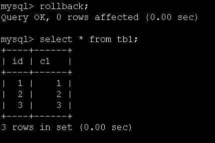
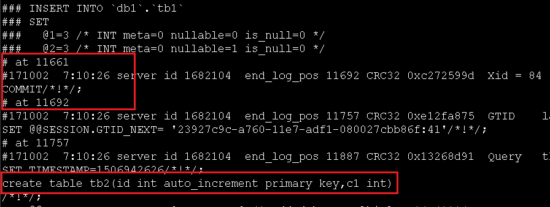

众所周知MySQL的DDL语句是非事务的，即不能对DLL语句进行回滚操作，哪在事务中包含DDL语句会怎样呢？

如：

复制代码
#禁用自动提交
set autocommit=off;
#创建tb1
create table tb1(id int auto_increment primary key,c1 int);
#开始事务
start transaction;
#插入数据
insert into tb1(c1) select 1;
insert into tb1(c1) select 2;
insert into tb1(c1) select 3;
#创建tb2
create table tb2(id int auto_increment primary key,c1 int);
复制代码
这时候如果执行rollback，会发现插入到tb1中数据没有被回滚:

如果查看binlog：

在创建tb2之前，有一个commit操作将上面语句中的事务进行提交，因此虽然后面执行了rollback操作，但实际上rollback的是另外一个空事务，所以没有任何数据发生“回滚”。

=============================================================================

在执行研发同事提交的脚本时，应当将DDL和DML语句以及DCL语句严格分开，避免事务被隐性“破坏”，导致误操作情况发生。

比如你打开一个事务正在修改数据，恰好研发同事找你在这个库上新建一个表，剪完你发现自己数据改错了，此时再想回滚就悲剧啦！

又比如研发给你一个事务脚本，中间夹渣一个DDL语句，导致事务“中途”提交一次，等最后发现异常要回滚却发现只能回滚一部分。

=============================================================================

当执行到DDL语句时，会隐式的将当前回话的事务进行一次“COMMIT”操作，因此在MySQL中执行DDL语句时，应该严格地将DDL和DML完全分开，不能混合在一起执行。总结：