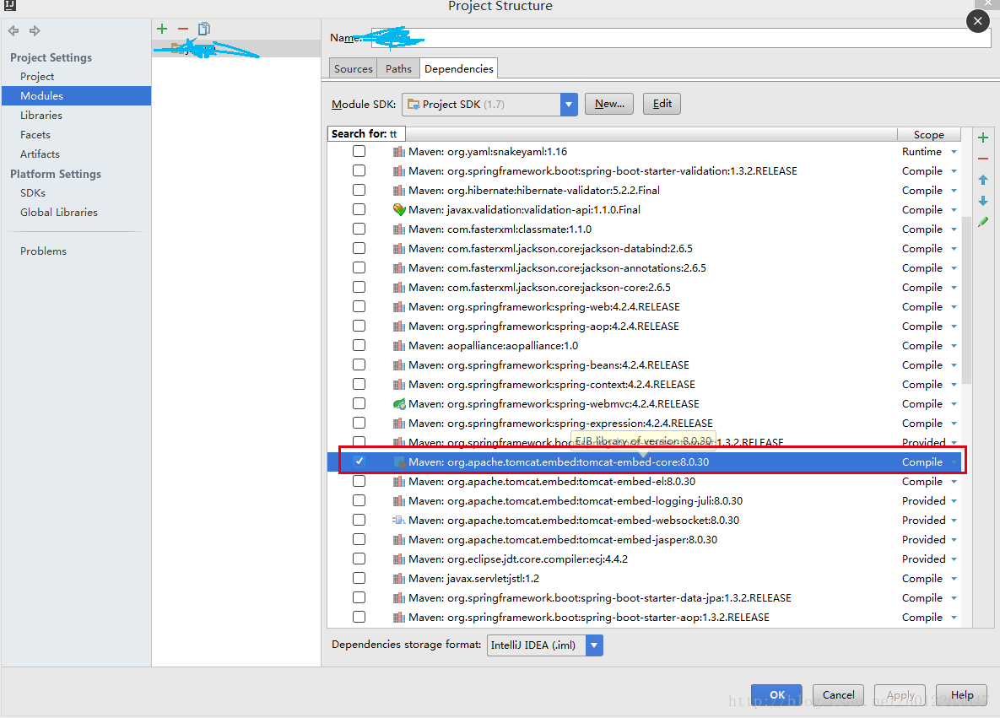

# [解决intellij中sPRing boot工程 无法用mainapplication启动问题](https://my.oschina.net/gyuan/blog/1579216)

一、spring boot 工程 从svn库导出到 intellij idea中 后用mainApplication中的main函数启动时会出现

Failed to introspect annotated methods on class org.springframework.boot.context.web.SpringBootServletInitializer 的错误 原因是 intellij idea中 工程的tomcat需要再次配置一下

pom.xml 配置了jar包后，intellij idea 不会自动引入的

选择 File -> Project Structure->Modules->Dependencies

找到 tomcat-embed-core 的jar包 作用域默认是provided ，把它改为 compile。

